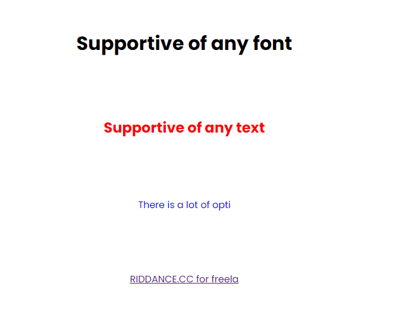

# typewriter-effect
A pure javascript powered typewriter effect that supports multiple font styles with multiple options. 



# Place the line of code below at the end of body:
```html
<script src="https://cdn.jsdelivr.net/gh/RiddanceDev/typewriter-effect/index.js"></script>
```

# You can also change the following options:
Please ensure you declare them before importing typewriter-effect/index.js
```html
<script>
    var typeWriteOptions = {
        "deleteSpeed": 50, // 0.05 seconds between deleting each character
        "typeSpeed": 100, // 0.1 seconds between each character
        "addRandomToType": false, // add a random amount of time to delete & type speeds
        "blinkSpeed": 600, // how often the blinker changes from blinkerColor to transparent
        "blinkerEnabled": true, // should a blinker be added after the inner text
        "beforeDeleteDelay": 1000 // once fully typed, 1 second until it deletes 
    };
</script>
```

# Then simply add the class name to any element in your body:
```html
<a href="https://riddance.cc/" class="typewriter-effect">RIDDANCE.CC for freelance...</a>
```
